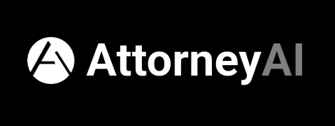

# AttorneyAI: AI-Powered Charge Identification Tool

**AttorneyAI** is an artificial intelligence tool designed to assist police officers in identifying appropriate legal sections and charges applicable to a given complaint description or incident. By analyzing the details of a case, AttorneyAI helps streamline the process of mentioning relevant sections in the First Information Report (FIR).

## Table of Contents

- [About AttorneyAI](#about-attorneyai)
- [Features](#features)
- [Demo](#demo)
- [Tech Stack](#tech-stack)
- [Contact](#contact)

## About AttorneyAI

AttorneyAI aims to enhance the efficiency and accuracy of charge identification for law enforcement officials. By leveraging AI capabilities, it can process complaint narratives and incident details to suggest applicable legal sections, aiding officers in the preparation of FIRs. This tool is intended to be a supportive resource in the initial stages of case documentation.

## Features

* **Complaint Analysis:** Analyzes complaint descriptions and incident details.
* **Section Identification:** Identifies potentially applicable legal sections for charge identification.
* **Assistance in FIR Preparation:** Supports police officers in including relevant sections in the FIR.
* **User-Friendly Interface:** Designed for ease of use by law enforcement personnel.

## Demo

See AttorneyAI in action!

## Tech Stack

* **Frontend:** Flutter
* **Backend:** FastAPI, Python
* **Machine Learning:** Llama.cpp, Unsloth
* **Database:** Firebase

## Contact

If you have any questions or need support, please reach out to us using the following methods:

*   **Email:** [sarveshwashindkar@gmail.com](mailto:sarveshwashindkar@gmail.com)
*   **GitHub Issues:** You can report bugs or request features on our [GitHub Issues page](https://github.com/Sarvesh-Washindkar/AttorneyAI/issues)

We strive to respond to all inquiries within a reasonable timeframe. Thank you for your interest in our project!